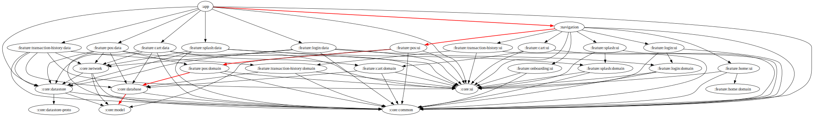

# Shopping App

A modern e-commerce mobile application built with Jetpack Compose and Clean Architecture principles.

## Features

### Core Features
- **Paginated Product Listing**: Efficiently loads products as you scroll
- **Product Sorting**: Sort products by price, newest, etc.
- **Product Details**: View comprehensive product information
- **Shopping Cart**: Add products to cart with quantity control
- **Clean UI**: Modern material design with dark mode support

### Technical Features

- **Clean Architecture**: Separation of concerns with domain, data, and presentation layers
- **MVVM Pattern**: Using ViewModels and StateFlow for reactive UI updates
- **Pagination**: Efficient data loading with Jetpack Paging 3
- **State Management**: Robust state handling with sealed classes
- **Dependency Injection**: Using Hilt for clean dependency management

## Libraries Used

- **Jetpack Compose**: UI toolkit
- **Jetpack Paging 3**: Pagination library
- **Hilt**: Dependency injection
- **Coil**: Image loading
- **Retrofit**: Network requests
- **Kotlin Coroutines & Flow**: Asynchronous programming
- **Material3**: Design system

## Project Structure

